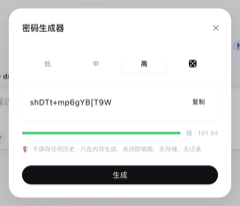
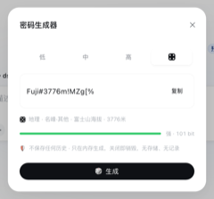

# dsh-password-generator

「密码生成器」插件 — 为 DeepSeek Harness Web GUI 侧边栏添加一个密码生成器入口：随机生成密码（低/中/高档），第四档「🎲 有意义」由 Agent/LLM 生成，**不保存任何历史**。

双面包架构（client 半 + host 半 Remote 服务）：浏览器端生成低/中/高，第四档经 host 半调用 `ctx.llm`（API key 只在 host 进程内，不进入浏览器）。

## 截图

> 弹层界面：四档切换（低／中／高／🎲），第四档「🎲 有意义」由 Agent/LLM 生成，
> 来源行显示具体含义（主题 · 子分类 · 具体事实），强度条按字符集 × 长度估算熵。

|  |  |
| :---: | :---: |
| 「高」档 · 16 位四类字符，本地随机 | 「🎲」档 · AI 生成，来源行显示含义 |

## 包结构

```
dsh-password-generator/
├── package.json          # 双面声明：dsh.client（web 平台 + inject 边）+ main/exports
├── tsdown.config.ts      # 规范构建配置（monorepo 工具链可用时）
├── scripts/
│   ├── build.mjs         # 零依赖构建：产出 lib/ 两个产物
│   ├── smoke-host.mjs    # host 半冒烟测试（校验/重试/兜底/Remote 标记）
│   ├── smoke-client.mjs  # client 半冒烟测试（bundle 格式/注入/Remote 挂载）
│   └── verify-guard.mjs  # 探针：guarded-facade 下用 ctx.get 访问 Remote 命名空间
├── src/
│   ├── host/index.js     # host 半源码：PasswordGeneratorRuntime
│   └── client/index.js   # client 半源码：入口 + 弹层 UI
└── lib/
    ├── index.js          # 构建产物：host 半（ESM，loader 直接 import）
    └── client.js         # 构建产物：lazy-CJS bundle（window.__ModuleLoader__.load）
```

## 构建与测试

```sh
npm run build   # node scripts/build.mjs → 重新生成 lib/index.js + lib/client.js
npm run check   # node --check 两个产物
node scripts/smoke-host.mjs    # host 半逻辑测试（真实 dsh-typert-protocol / cordis）
node scripts/smoke-client.mjs  # client 半 wiring 测试
```

> 测试需要解析 `@deepseek-ai/*` 依赖：本仓库已把全局 dsh 安装的对应包软链进
> `node_modules/@deepseek-ai/`（见下文「安装」一节，软链复用同一来源）。

## 工作原理

- **入口**：client 半在 `apply(ctx)` 中 `ctx.slots.inject("sidebar.footer.action", …)` 注册列表项
  （该槽由 `dsh-client-ui-sidebar` 声明，`kind: list, scope: root`），点击 🔑 打开弹层，关闭即卸载组件。
- **低/中/高**：浏览器内 `crypto.getRandomValues`（拒绝采样，无模偏差）即时生成；
  每档保证至少含一个所属字符类，并剔除易混淆字符 `0O1lI`。
- **🎲 有意义**：浏览器半经 `ctx.remote.$mount(TYPERT_REMOTE)` 挂载
  `passwordGenerator/generateMeaningful`（与 `ctx.remote.commands.list()` 同构的 Remote 通道）→
  host 半 `PasswordGeneratorRuntime` 调 `ctx.llm.stream`（默认模型路由取自
  `ctx.agentDefaultModel`），对输出做 16 位 + 四类字符校验，失败重试（共 3 次），
  仍失败则回退内置词库并标注「本地词库兜底」。
- **无历史**：无 localStorage / IndexedDB / settings / storage / 会话写入；
  密码只存在于弹层组件 state，关闭/切换档位即销毁。

## 安装（web profile）

1. 链接包（供 loader 解析，与 `dsh-app-boot` 的 `healProfilesModuleFallback`
   同一共享目录）：

   ```sh
   ln -sfn "$PWD" ~/.dsh/profiles/node_modules/dsh-password-generator
   ```

   （等价替代：`dsh plugin --profile web add <本目录>`，需要 pnpm。）

2. 在 `~/.dsh/profiles/web/cordis.patch.yml` 追加（loader 行 → host 半激活，
   同时 `dsh-client-modules` 扫描该行的 `dsh.client` 元数据并服务 client 半）：

   ```yaml
   - insert:
       - id: ui-password-generator
         name: 'dsh-password-generator'
   ```

3. 重启 web profile（插件集变更需重启生效）：

   ```sh
   dsh web
   ```

4. 刷新浏览器：侧边栏底部设置旁出现 🔑 密码生成器入口。

## 回归清单

- [ ] 低/中/高即时生成；强度条按 字符集×长度 熵显示 弱/中/强 + bit 数
- [ ] 🎲 档按钮变「🎲 生成」，骰子翻滚动效（旋转 + 点数跳动）+ 生成中禁用
- [ ] 🎲 档来源行显示 Agent 生成说明；LLM 失败时显示「本地词库兜底 · …」
- [ ] 复制按钮写入剪贴板（navigator.clipboard / writeClipboard）
- [ ] 关闭弹层 / 切换档位后密码即消失；检查 localStorage、请求面板、会话日志无残留
